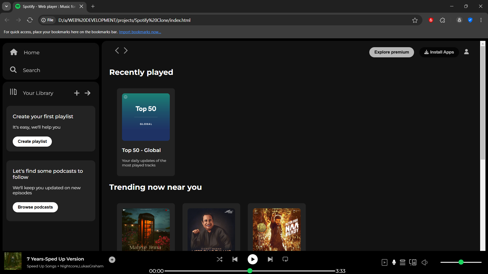

# 🎧 Spotify Clone (HTML & CSS)

A simple and responsive clone of the Spotify homepage designed using only HTML and CSS. This project was created for front-end practice and design improvement, replicating the clean look and feel of Spotify’s official site.

---

## 🛠️ Features
- Modern UI inspired by Spotify
- Responsive design for desktop, tablet, and mobile
- Clean layout with sections like navbar, hero, and footer
- Built using only HTML5 and CSS3 (no JavaScript)

---

## 🚀 Technologies Used
- HTML5
- CSS3
- Flexbox & Grid
- Google Fonts (optional)
- Font Awesome (for icons – optional)

---

## 📸 Preview

---

## 🌐 Live Demo
https://harsha47474.github.io/Spotify-Clone-HTML-CSS-/

